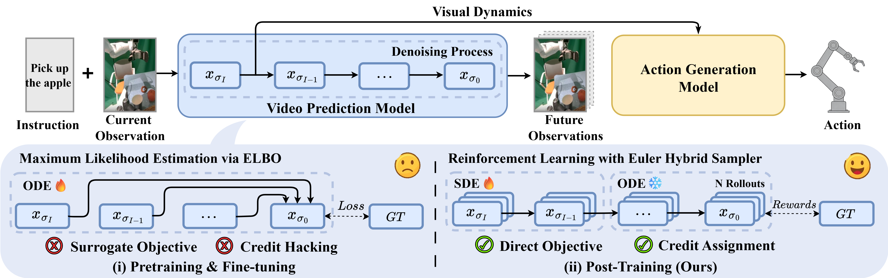

<div align="center">

# 👉 Dyn-VPP: Video Prediction Policy with Dynamic Optimization  

<a href='https://arxiv.org/abs/xxxx'></a> 
<a href='https://dyn-vpp.github.io/Dyn-VPP'></a> 

</div>

---

## 🚀 Overview

Video action models are a promising foundation for Vision–Language–Action (VLA) because they can learn rich visual dynamics directly from video. However, likelihood-oriented training of diffusion predictors emphasizes globally plausible futures and does not guarantee precision-critical visual dynamics needed for manipulation, so small prediction errors can be amplified by downstream policies.  

We propose **Dyn-VPP**, a post-training framework that casts multi-step denoising as policy optimization and aligns predicted future latents with expert visual dynamics via a verifiable terminal reward, without modifying any architecture. This enables explicit optimization of dynamics signals that are not captured by likelihood-only training. As a result, Dyn-VPP yields more accurate visual dynamics and improves downstream task execution. Experiments across diverse simulated and real-world manipulation settings show that Dyn-VPP achieves improved dynamics consistency and consistently higher task success.

<p>
    
</p>

## 📌 Release Progress
- [x] Inference and evaluation code on Calvin
- [ ] Reinforcement learning post-training code

## 🛠️ Installation 
```bash
conda create -n dyn-vpp python==3.11
conda activate dyn-vpp

# Install calvin as described in (https://github.com/mees/calvin). 
git clone --recurse-submodules https://github.com/mees/calvin.git
$ export CALVIN_ROOT=$(pwd)/calvin
cd $CALVIN_ROOT
sh install.sh

# Install dyn-vpp requirements
cd ..
pip install -r requirements.txt
```


## 📷 CheckPoints 


| Ckpt name     | Training type | Size |
|---------------|------------------|---------|
| [clip-vit-base-patch32](https://huggingface.co/openai/clip-vit-base-patch32)  | CLIP text encoder, freezed during training        |  ~600M   |
| [svd-robot](https://huggingface.co/yjguo/svd-robot/tree/main)  | SVD video model finetuned on sthv2，openx and xhand        | ~8G    |
| [svd-robot-calvin](https://huggingface.co/yjguo/svd-robot-calvin-ft/tree/main) |   SVD video model finetuned on sthv2, openx and calvin abc video    | ~8G   |
| [dp-calvin](https://huggingface.co/yjguo/dp-calvin/tree/main) |   Action model trained on annoted calvin abc dataset    |  ~1G  |


## 📊 Reproducing the results in paper 
### 📊 Rollout on calvin abc benchmark
First, you need to follow instructions in the [officail calvin repo](https://github.com/mees/calvin) to install the calvin environments and download official calvin ABC-D dataset(about 500 G).

Next, download the [svd-robot-calvin](https://huggingface.co/yjguo/svd-robot-calvin-ft/tree/main) video model and [dp-calvin](https://huggingface.co/yjguo/dp-calvin/tree/main) action model. Set the video_model_folder and action_model_folder to the folder where you save the model.

```bash
python policy_evaluation/calvin_evaluate.py --video_model_path ${path to svd-robot-calvin} --action_model_folder ${path to dp-calvin} --clip_model_path ${path to clip} --calvin_abc_dir ${path to calvin dataset} 
```

## Acknowledgement

Dyn-VPP is developed from [Video prediction policy](https://github.com/roboterax/video-prediction-policy). We thank the authors for their efforts!


