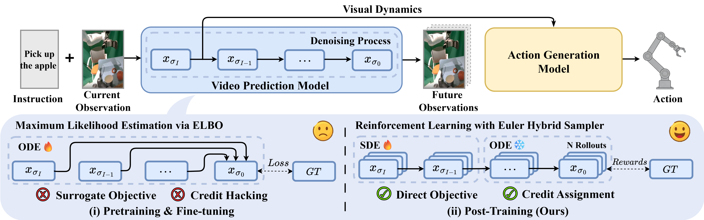

<div align="center">

# VAMPO: Policy Optimization for Improving Visual Dynamics in Video Action Models

<a href='https://arxiv.org/pdf/2603.19370'></a> 
<a href='https://vampo-robot.github.io/VAMPO/'></a> 
<a href='https://huggingface.co/williammmgezju'></a>
</div>

---

## 🚀 Overview

Video action models are an appealing foundation for Vision–Language–Action systems because they
can learn visual dynamics from large-scale video data and transfer this knowledge to downstream robot
control. Yet current diffusion-based video predictors are trained with likelihood-surrogate objectives,
which encourage globally plausible predictions without explicitly optimizing the precision-critical
visual dynamics needed for manipulation. This objective mismatch often leads to subtle errors in
object pose, spatial relations, and contact timing that can be amplified by downstream policies. We
propose VAMPO, a post-training framework that directly improves visual dynamics in video action
models through policy optimization. Our key idea is to formulate multi-step denoising as a sequential
decision process and optimize the denoising policy with rewards defined over expert visual dynamics in
latent space. To make this optimization practical, we introduce an Euler Hybrid sampler that injects
stochasticity only at the first denoising step, enabling tractable low-variance policy-gradient estimation
while preserving the coherence of the remaining denoising trajectory. We further combine this design
with GRPO and a verifiable non-adversarial reward based on L1 distance and cosine similarity. Across
diverse simulated and real-world manipulation tasks, VAMPO improves task-relevant visual dynamics,
leading to better downstream action generation and stronger generalization.

<p>
    
</p>

## 📌 Release Progress
- [x] Inference and evaluation code on Calvin
- [x] Reinforcement learning post-training code

## 🛠️ Installation 
```bash
conda create -n VAMPO python==3.10
conda activate VAMPO

# Install calvin as described in (https://github.com/mees/calvin). 
git clone --recurse-submodules https://github.com/mees/calvin.git
$ export CALVIN_ROOT=$(pwd)/calvin
cd $CALVIN_ROOT
sh install.sh

# Install VAMPO requirements
cd ..
pip install -r requirements.txt
```


## 📷 CheckPoints 


| Ckpt name     | Training type | Size |
|---------------|------------------|---------|
| [VPP_svd](https://huggingface.co/yjguo/svd-robot-calvin-ft/tree/main) |   Baseline SVD video model    | ~8G   |
| [VAMPO_svd](https://huggingface.co/williammmgezju/VAMPO_SVD)  | SVD video model trained by our method        | ~8G    |
| [VAMPO_policy](https://huggingface.co/williammmgezju/VAMPO_policy) |   Action model trained on annoted calvin abc dataset    |  ~1G  |
| [clip-vit-base-patch32](https://huggingface.co/openai/clip-vit-base-patch32)  | CLIP text encoder       |  ~600M   |


## 📊 Evaluation on Calvin abc benchmark
First, you need to follow instructions in the [officail calvin repo](https://github.com/mees/calvin) to install the calvin environments and download official calvin ABC-D dataset(about 500 G).

Next, download the [VAMPO_svd](https://huggingface.co/williammmgezju/VAMPO_SVD) video model and [VAMPO_policy](https://huggingface.co/williammmgezju/VAMPO_policy) action model. Set the video_model_folder and action_model_folder to the folder  where you save the model in the script.

```bash
bash scripts/eval_calvin.sh
```

## 📊 Training VAMPO on Calvin

### 🛸 Stage 1: Finetuning video model if needed!
If you just want to try RL training in VAMPO, just download the checkpoint [VPP_svd](https://huggingface.co/yjguo/svd-robot-calvin-ft/tree/main) and skip this section. 

(1) Since the video diffusion model are run in latent space of image encoder, we need to first extract the latent sapce of the video. This process will save GPU memory cost and reduce training time. Run `step1_prepare_latent_data.py` to prepare latent. The dataset format should be similar to `video_dataset_instance`. 

You can directly download features for something-something-v2, bridge, rt1 and calvin from [huggingface dataset:vpp_svd_latent](https://huggingface.co/datasets/yjguo/vpp_svd_latent/tree/main)

(2) After prepare the latent, you need to reset the following parameters in `video_conf/train_svd.yaml`: `dataset_dir` is the root path of datasets; `dataset` is different video dataset used for finetuning and connected with `+`; `prob` is the sample ratio of each dataset. 

```bash
accelerate launch --main_process_port 29506 step1_train_svd.py --config video_conf/train_calvin_svd.yaml --pretrained_model_path ${path to svd-robot}
```

### 🛸 Stage 1: Reinforcememt learning with Euler hybrid sampling

After downloading finetuned SVD checkpoint or training it from scratch, you can modify the configs and start RL training !

```bash
bash scripts/train_calvin_svd_grpo.sh
```

### 🛸 Stage 2: Training action model

Important: We highly encourage you to **check the video prediction results** before policy learning, since the policy performance are highly depand on the video prediction quality. Some samples are automatically saved during training. You can also make more predcitions following the instructions in the video prediction section.

Set the argument `video_model_path` to the video model you finetuned, the argument `root_data_dir` to where Calvin-ABC dataset located, the argument `text_encoder_path` to path to clip-vit-base-patch32 

```bash
accelerate launch step2_train_action_calvin.py --root_data_dir ${path to Calvin dataset} --video_model_path ${path to video model} --text_encoder_path ${path to clip}

## Acknowledgement

VAMPO is developed from [Video prediction policy](https://github.com/roboterax/video-prediction-policy). We thank the authors for their efforts!


## Citation

If you find this project useful in your research, please cite:

```bibtex
@article{ge2026vampo,
  title={VAMPO: Policy Optimization for Improving Visual Dynamics in Video Action Models},
  author={Ge, Zirui and Ding, Pengxiang and Yin, Baohua and Wang, Qishen and Xie, Zhiyong and Wang, Yemin and Wang, Jinbo and Li, Hengtao and Suo, Runze and Song, Wenxuan and Zhao, Han and Lyu, Shangke and Fan, Zhaoxin and Li, Haoang and Cheng, Ran and Chi, Cheng and Ge, Huibin and Luo, Yaozhi and Wang, Donglin},
  journal={arXiv preprint arXiv:2603.19370},
  year={2026}
}
